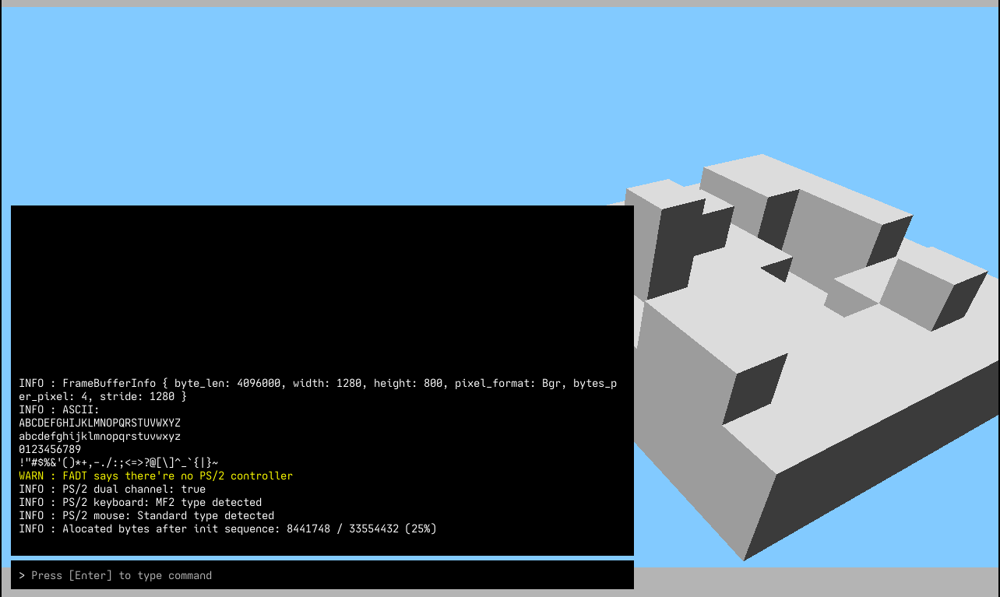

# minecraft-os

[](https://github.com/ixora-0/minecraft-os/actions/workflows/ci.yml)
[](https://github.com/ixora-0/minecraft-os/releases/latest)

An x86_64 operating system written in Rust, inspired by Minecraft. It boots
on bare metal (or in a virtual machine) via UEFI or legacy BIOS, and currently
includes a framebuffer graphics stack, a text console, keyboard input, and more.



## Try it

Prebuilt disk images are published on the
[Releases page](https://github.com/ixora-0/minecraft-os/releases).

### Prerequisites

- [QEMU](https://www.qemu.org/) with `qemu-system-x86_64` on your `PATH`.
  - Debian / Ubuntu: `sudo apt install qemu-system-x86`
  - Arch: `sudo pacman -S qemu-full`
  - Fedora: `sudo dnf install qemu-system-x86`
  - macOS (Homebrew): `brew install qemu`

### UEFI

From the latest release, download:

- `minecraft-os-<version>-uefi.img`
- `OVMF_CODE.fd`
- `OVMF_VARS.fd`
- `run-uefi.sh`

Put them all in the same folder, then:

```sh
chmod +x run-uefi.sh
./run-uefi.sh minecraft-os-<version>-uefi.img
```

### BIOS

Download `minecraft-os-<version>-bios.img` from the release and run:

```sh
qemu-system-x86_64 -drive format=raw,file=minecraft-os-<version>-bios.img -serial stdio
```

### Real hardware

Either image can be flashed to a USB stick and booted on real hardware — use
the `-uefi.img` for UEFI systems and the `-bios.img` for legacy BIOS systems:

```sh
sudo dd if=minecraft-os-<version>-uefi.img of=/dev/sdX bs=4M status=progress conv=fsync
```

Double-check the target device path before running `dd` — getting it wrong
will destroy data.

## Building from source

Requires a Rust **nightly** toolchain (pinned in `rust-toolchain.toml`) and
[`just`](https://github.com/casey/just) for the task runner. A `flake.nix` is
provided for Nix users.

```sh
just build-release       # build
just run                 # build + boot in QEMU (UEFI)
just run-bios            # build + boot in QEMU (BIOS)
just test                # unit tests
just test-integration    # integration tests
```

## Project layout

- `kernel/` — the bare-metal kernel (`x86_64-unknown-none`)
- `kernel-core/` — shared core components (graphics, math, etc.)
- `src/` — host-side tooling: image builder and QEMU launchers
- `tests-integration/` — integration tests run under QEMU
- `.github/workflows/release.yml` — CI that builds and publishes releases

## Acknowledgements

Huge thanks to [Philipp Oppermann](https://github.com/phil-opp) and his
[Writing an OS in Rust](https://os.phil-opp.com/) blog series, which this
project leans on heavily.
