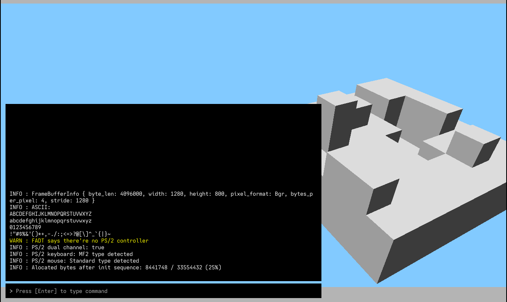

# minecraft-os

[](https://github.com/ixora-0/minecraft-os/actions/workflows/ci.yml)
[](https://github.com/ixora-0/minecraft-os/releases/latest)

An x86_64 operating system written in Rust, inspired by Minecraft. Features:

- Framebuffer graphics stack
- Text console with keyboard input
- Interactive gameplay: move with WASD, break/place blocks with mouse
- Persistent storage (save/load world state via NVMe or AHCI)
- Boots via UEFI or legacy BIOS



## Try it

Prebuilt disk images are published on the
[Releases page](https://github.com/ixora-0/minecraft-os/releases).

### Prerequisites

- [QEMU](https://www.qemu.org/) with `qemu-system-x86_64` on your `PATH`.
  - Debian / Ubuntu: `sudo apt install qemu-system-x86`
  - Arch: `sudo pacman -S qemu-full`
  - Fedora: `sudo dnf install qemu-system-x86`
  - macOS (Homebrew): `brew install qemu`

### UEFI

From the latest release, download:

- `minecraft-os-<version>-uefi.img`
- `OVMF_CODE.fd`
- `OVMF_VARS.fd`
- `run-uefi.sh`

Put them all in the same folder, then:

```sh
chmod +x run-uefi.sh
./run-uefi.sh minecraft-os-<version>-uefi.img [--nvme] [--ahci]
```

The script accepts these optional flags for persistent storage (needed for saving/loading worlds):
- `--nvme` — attach an NVMe disk (creates `NVME.img`)
- `--ahci` — attach an AHCI disk (creates `AHCI.img`)

### BIOS

Download `minecraft-os-<version>-bios.img` from the release and run:

```sh
qemu-system-x86_64 -drive format=raw,file=minecraft-os-<version>-bios.img -serial stdio
```

### Real hardware

Either image can be flashed to a USB stick and booted on real hardware.
Use the `-uefi.img` for UEFI systems and the `-bios.img` for legacy BIOS systems:

```sh
sudo dd if=minecraft-os-<version>-uefi.img of=/dev/sdX bs=4M status=progress conv=fsync
```

Double-check the target device path before running `dd`, getting it wrong
will destroy data.

## Persistent storage on real hardware

When booting on real hardware, the OS needs to know which disk sector (LBA) is
safe to write save data to. **Writing to the wrong LBA will corrupt your
filesystem.** The example guide provided below only works on Linux with **ext4** filesystems.

### Setup (run from Linux on the target machine)

1. Create a 4 KiB file filled with zeros:

```sh
dd if=/dev/zero of=/path/to/savefile bs=4096 count=1
sync
```

2. Find the file's physical sector offset:

```sh
filefrag -v -b512 savefile
```

Look for the `physical_offset` value in the output, for example:

```
ext:  logical_offset: physical_offset: length:  expected: flags:
  0:        0..       7:  75804800..75804807:      8:         last,eof
```

Here the file starts at sector `75804800`.

3. Find the partition's starting LBA:

```sh
# Replace nvme0n1p1 with whichever partition holds savefile
cat /sys/block/nvme0n1/nvme0n1p1/start
```

4. Calculate the LBA:

```
save_lba = partition_start + physical_offset
```

### Using save/load in the OS

After booting into minecraft-os, open the console and run:

```
set-lba <save_lba>
save
```

To load a previously saved world:

```
set-lba <save_lba>
load
```

### Cleanup

When you're done, you can remove the file from Linux:

```sh
rm ~/savefile
```

## Building from source

Requires a Rust **nightly** toolchain (pinned in `rust-toolchain.toml`) and
[`just`](https://github.com/casey/just) for the task runner. A `flake.nix` is
provided for Nix users.

```sh
just build-release       # build
just run                 # build + boot in QEMU (UEFI)
just run-bios            # build + boot in QEMU (BIOS)
just test                # unit tests
just test-integration    # integration tests
```

## Project layout

- `kernel/` — the bare-metal kernel (`x86_64-unknown-none`)
- `kernel-core/` — shared core components (graphics, math, etc.)
- `src/` — host-side tooling: image builder and QEMU launchers
- `tests-integration/` — integration tests run under QEMU

## Acknowledgements

Huge thanks to [Philipp Oppermann](https://github.com/phil-opp) and his
[Writing an OS in Rust](https://os.phil-opp.com/) blog series, which this
project leans on heavily.
